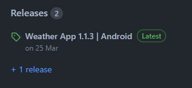

# Weather App

App de clima simples para qualquer cidade **brasileira**, construído utilizando a API do __[Open Weather Map](https://openweathermap.org/)__

__[Clique aqui para acessar a página web!](https://weather-webapp-tau.vercel.app/)__

## Instalação Android

Para fazer o download da versão mais atualizada do app, você pode __[clicar aqui!](https://expo.dev/artifacts/eas/ftPF9h2FVUrBdMrvhRaw9j.apk)__ Ou se quiser uma versão específica, pode procurá-la na aba de "lançamentos" aqui no repositório:

## Observações

Este repositório possui apenas o código da versão web do app. Para acessar o código da versão nativa __[clique aqui!](https://github.com/AluisioNBR/weather-app)__